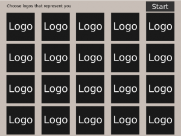
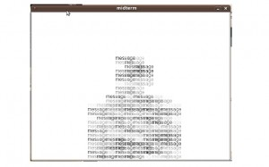

# ICM Midterm Project

For my ICM midterm project I want the user to choose a series of of websites that they identify with and using rss feeds compose a text-ural representation of themselves.

This would be the first prompt

After to press start it should either take a video capture or a image of you and create the display below

