# PComp Midterm-MIDI Light Table: Making the table

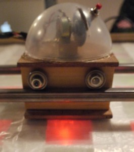

For our physical computing midterm Julio Terra, Michael Martinez-Campos, and Myself created a MIDI based light table. We used LEDs in a gradient pattern and a puck like object with photocells to achieve this. The photocells pick up the brightness from the LEDs. The Photocells are connected to the Arduino. Through Processing and using the OSC library we turn the photocell values into MIDI. The light has 2 sets of lights, green and red. Each of cell is composed of a red and green light. The cells provide 2 discrete values that affect the MIDI values that go to the music software. The MIDI information could then be used by many music software. In our case we chose Ableton. This article mostly focuses on the making of the light table.

<object height="300" width="400"><param name="allowfullscreen" value="true"></param><param name="allowscriptaccess" value="always"></param><param name="movie" value="http://vimeo.com/moogaloop.swf?clip_id=7494936&server=vimeo.com&show_title=1&show_byline=1&show_portrait=0&color=&fullscreen=1"></param><embed allowfullscreen="true" allowscriptaccess="always" height="300" src="http://vimeo.com/moogaloop.swf?clip_id=7494936&server=vimeo.com&show_title=1&show_byline=1&show_portrait=0&color=&fullscreen=1" type="application/x-shockwave-flash" width="400"></embed></object>
[Physcomp Midterm – MIDI Light Table](http://vimeo.com/7494936) from [Zeven Rodriguez](http://vimeo.com/user2302394) on [Vimeo](http://vimeo.com).

One day while looking around the shop, I found this cardboard grid. The cardboard grid needed stiffening. Hot glue and a simple wood frame were used. This piece we meant only as a sketch but it seemed to be of great use in the prototype.

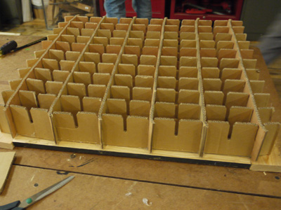

We decided to use foil to help with the diffusion of light.

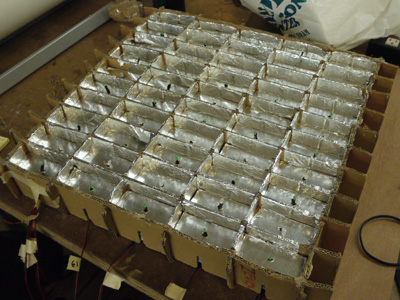

After soldering the 50 LEDs, we wired the rows of lights in parallel. This made it easy to make sure which lights were not working.

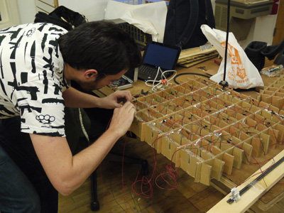

We decided to limit the puck object to get a better reading off the LEDs. Initially, we used a wood track to guide the movement of the puck.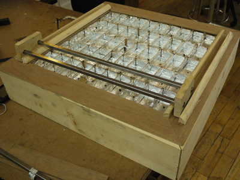

The wooden block between the tracks contains bearings which help guide the wood easier along the tracks.

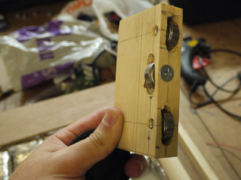

We used a resistor ladder to control the brightness of the lights.

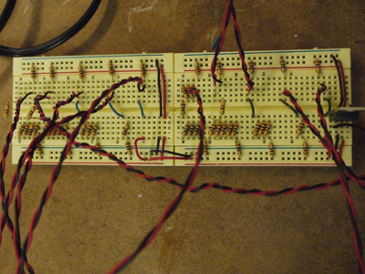

Due to the high friction and the lack of rigidity of wood, metal was used to fix this issue.

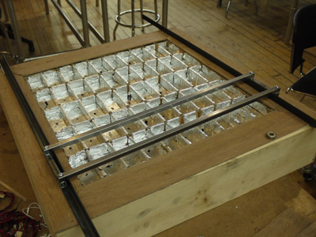

This was the first time we started testing the brightness of the LEDs and the readings from the photocells.

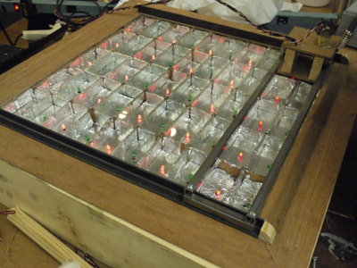

We decided to use 2 photocells per cell because after trying one per cell we were getting better readings.

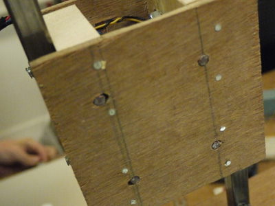

After the first test, we realized that we needed further diffusion of the light. After a chat with our professor, Tom Igoe he suggested some vellum for this purpose.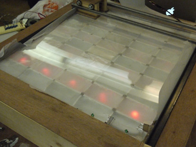The biggest challenge for use was to get the maximum output from the LEDs as possible. We learned that pots could help use vary the resistance of the voltage to get a range of LEDs. This was better then the resistance ladder because it was easier to set. We originally used 10k pots but there was not enough control. We ended up using 1k pots. After using a 5v voltage regulator, we achieved around 2.3 volts on the brightest row of LEDs.

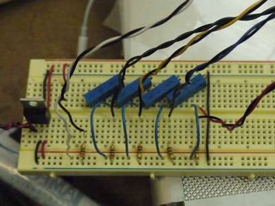

After testing, we found that our readings were difficult to map. To help achieve a better reading we decided to put in a push button to only pick up values when you pressed it. We also added a dome and a slit to put in a scroll-like wheel(which is actually a pot) to control volume.

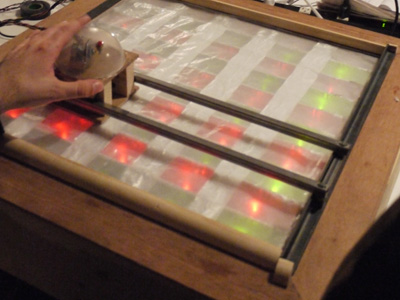

Here are Julio and Mike doing some testing and calibration.

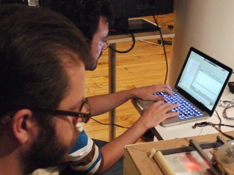

This is the final pot ladder for the lights.

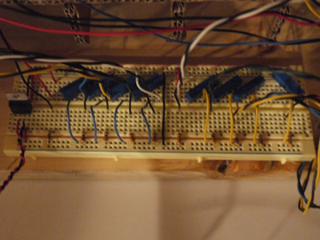

This is was the lights looked like when they were tuned.

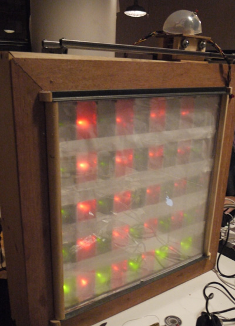

Our puck turned out to be a cool little mascot

In the end, the thing we learned most about this project is the amount of testing it really takes for something like this to work. Because of the photocells prefer something with a higher contrast, the table did not work out perfectly. For more information about the programming aspects of this project visit [Julio Terra’s blog](http://julioterrany.blogspot.com/search/label/ITP-IntroPhysicalComp)
