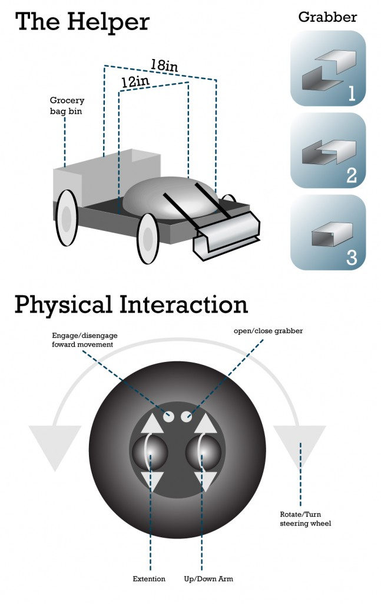

# Pcomp Final Concept Drawing

The Helper is a assitive technology robot. The purpose of the robot is to be able to pick up and reach objects for individuals in wheel chairs. The project is composed of 2 parts one is the Helper robot that is able to reach and grab the objects. The other is the control unit. One of the main design concerns for the control unit is that a lot of people of handicap cannot pinch. For this reason the orb works with large objects that rotate like a pot to control the robot.

