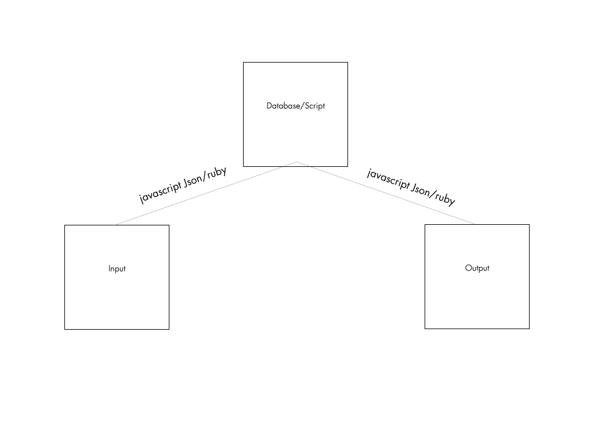
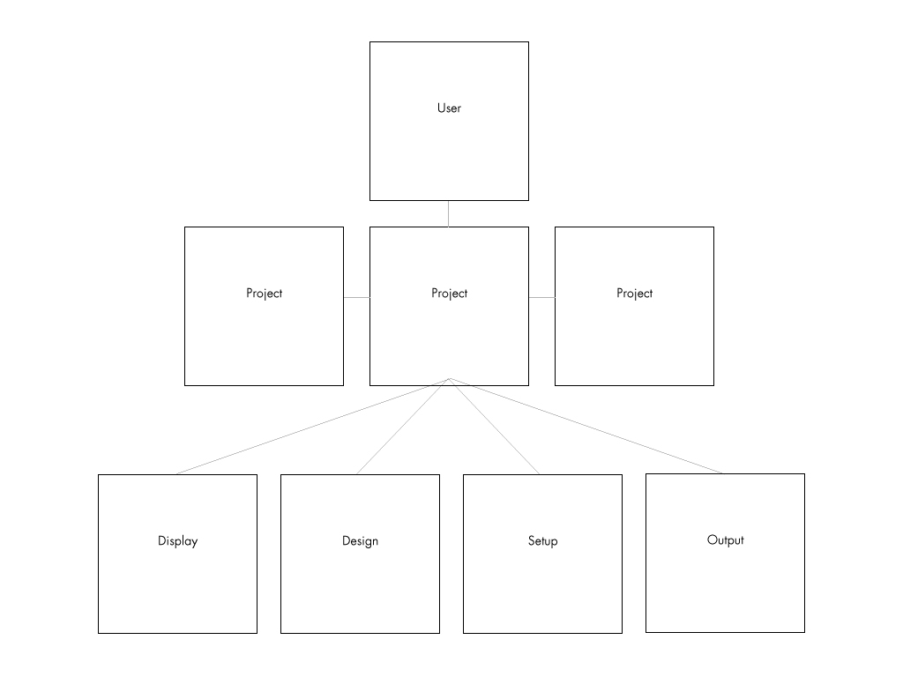
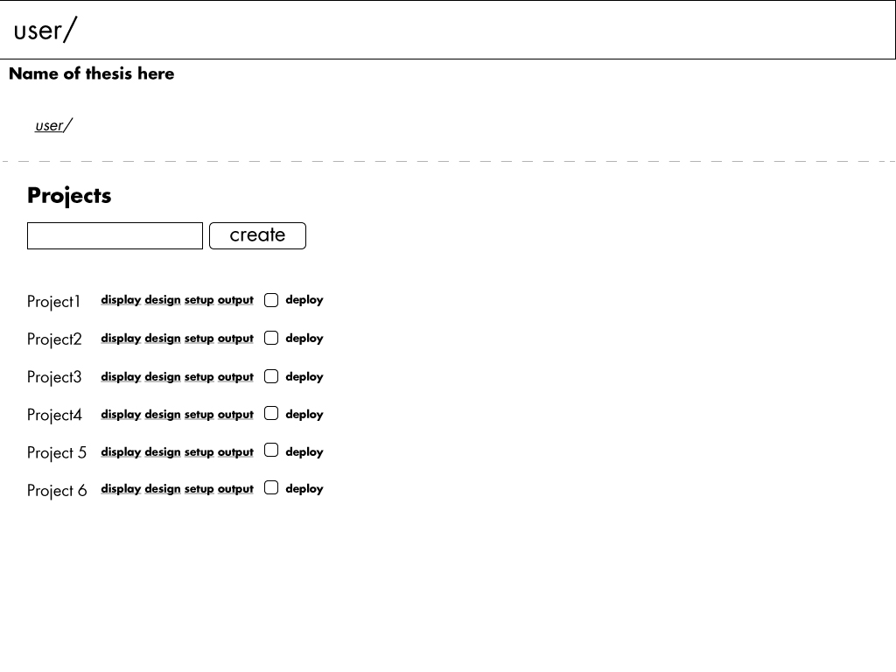
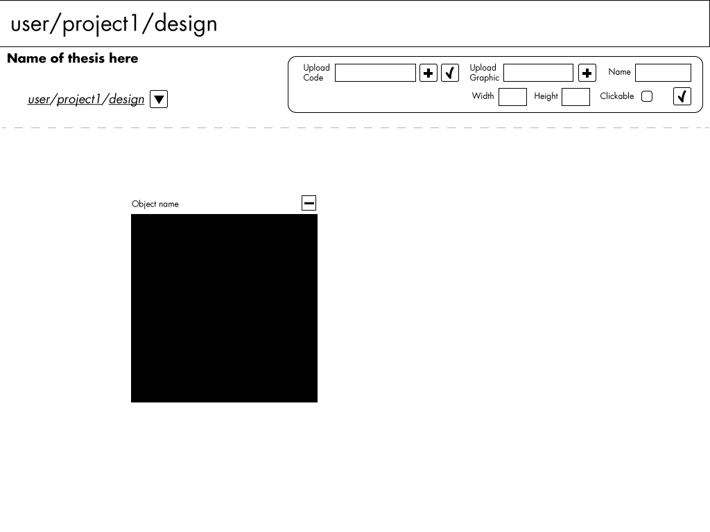
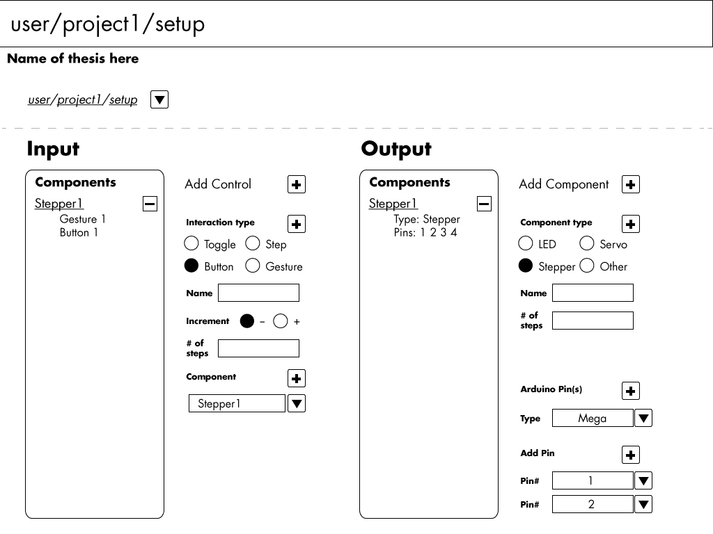
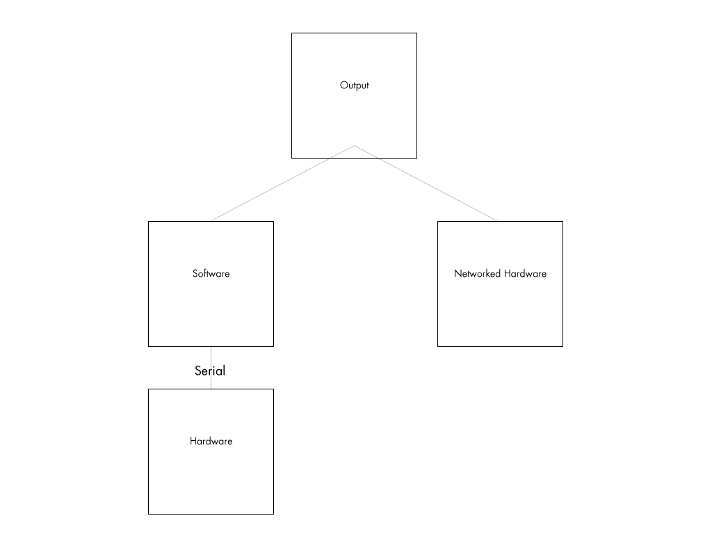
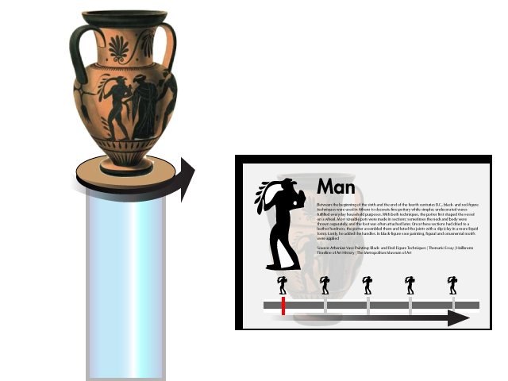
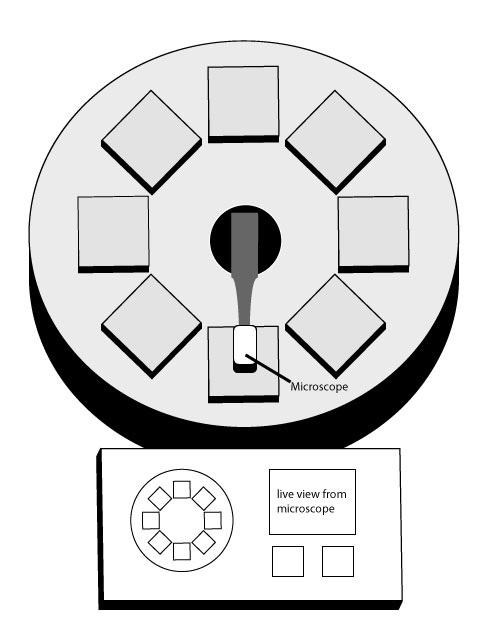

# Prototype and Production

My thesis system is based on a simple structure. You have an input, it is interpreted and an output is produced. This system is a web application and uses javascript and ruby to create the interaction.  For example, when a button or gesture is activated on a touchscreen, it turns on a light. This is how the system would interpret that: When the button is pressed, a message is fired to update the database, program that connect the microcontroller to the internet, is always checking the database for any change in the database. Since we pressed the button the state was changed. The light turns on. In order for this to happen, the user needs to complete a series of steps before this magic could happen. Users need to design, setup, and display their project. There are 3 tiers of interaction with system. There are a series of users that work with the system. The users have projects associated to them. Those projects have 4 points of interaction. The display, which is was the audience sees. The design, which is the place where the user creates the interface. The setup, which is the area that users setup the translation from gesture to hardware control. And finally, the output, which is what the microcontroller references to know what it should be doing, i.e. turning on a light.

Once users login, they will be taken to there projects area. Here are displayed all of the current projects. Users have quick access to view the 4 main areas: display, design, setup, and output. If the click on the actual project, an overview of the project would appear. There is also an deploy option, which sets the project live and ready for general consumption.

Areas of focus(What will be built out for thesis):

- Everything except the general diagnostics

Once the user creates a project they now have the option to start designing or setting up the project. In this case we’ll start with design. In this area users will be able to upload code already written or add graphical elements. When a graphical element is placed on the screen the user can drag it around to place it or delete it if not being used.

Areas of focus:

- Upload code (due to time constrains building an entire layout area is not feasible)

The setup section ties in the audiences interface with the output control. Here the user will add output components and the characteristics the control them. In this case we have a stepper. The stepper has certain attributes, like what pins its connected to, how many steps it has etc. The will also add the input controls which tells the system this button makes this stepper move 20 steps.

Area of focus:

- The 2 loads I will focus on are steppers and LEDs
- In the interaction type will be Gesture(being swipes, etc) Â and Button

The output area will actually be just so the program and find out its instruction(json). Either software can interpret the json or the actual networked hardware can read it. The user will be able to view this code to be able to create a better stream line interfacing with the microcontroller.

Area of focus:

- This is a crucial step that needs to be done

Build for thesis:

**Online Software (This should happen in the next 2 weeks)**

- 2 displays use cases using gestures
- User Main area
- Stepper Form
- Led Form
- Gesture Form
- Button Form
- Input Interpreter
- Output Interpreter

**Hardware (Rest of the Semester)**

- Software to interpret information coming from online
- Create 2 turntables
- Collect information to put in the display cases ie Vase and Elements or Minerals

These are the 2 use cases:

One is a rotating vase that updates content based on how the user rotates it .

Microfind is an exhibit that that focuses on kids exploring common items under a microscope. The exhibit has 2 modes: a learning and exploration and a memory game. Under the learning and exploration kids can click on cells on the interface to move a microscope over the object selected. Interesting information about the objects and a live view the microscope is displayed on the interface. The second mode is a memory game where kids will have to match an image of an object under microscope. The interface will change into a touchpad which will let the kids move the microscope in any direction. Once they match the picture to the live view, it will advance to the next image.

  

