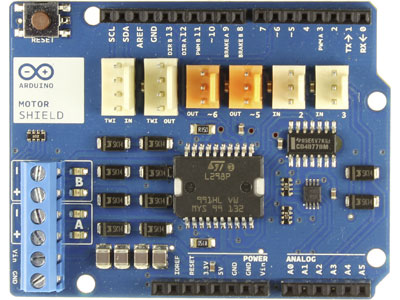
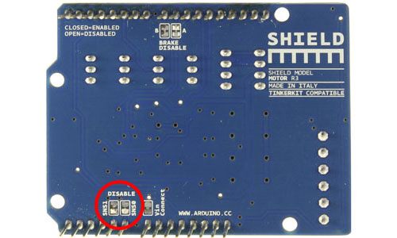

# Arduino Motor Shield

I have been working with the [Arduino Motor Shield](http://arduino.cc/en/Main/ArduinoMotorShieldR3). Here are some of the basic specs for the shield:

- Operating Voltage – 5v to 12v
- Motor Controller – L298P, Drives 2 DC Motors or 1 Stepper motor
- Max Current – 2A per channel or 4A max (with external power supply)
- Current Sensing – 1.65V/A
- Free Running stop and brake function

This Shield has 4 main functions:

<table border="0" width="50%"><tbody><tr><td align="left">**Function**</td><td align="center">**pins per Ch. A**</td><td align="center">**pins per Ch. B**</td></tr><tr><td align="left">*Direction*</td><td align="center">D12</td><td align="center">D13</td></tr><tr><td align="left">*PWM*</td><td align="center">D3</td><td align="center">D11</td></tr><tr><td align="left">*Brake*</td><td align="center">D9</td><td align="center">D8</td></tr><tr><td>*Current Sensing*</td><td align="center">A0</td><td align="center">A1</td></tr></tbody></table>The important thing to understand about this shield is the interface. Each channel has independent Direction, PWM, Brake, and Current Sensing. Setting the Direction Digital HIGH or LOW, moves the motor Clockwise or Counterclockwise. The PWM Pin can be set to Digital HIGH or LOW, which turns the motor On or Off, or can we sent and analogWrite to control the speed. When Brake is set to HIGH it forces the motor to Stop.

The last feature on the board is the Current Sensing, which you can access by doing a analogRead on the analog 0 and 1 pins. One important thing on the shield is that there are 2 soldered pins on the back that enable this feature.

IMPORTANT: When the current sense pins are soldered they cannot be used as general analog pins. You will get bad readings if you try to use A0 and A1.

**DC Motor**

This shield can run 2 DC motors

This is an example of running 2 DC Motors with Current Sense.

[Â https://github.com/zevenwolf/Motor-Shield/blob/master/DCMotor/DCMotor.ino](https://github.com/zevenwolf/Motor-Shield/blob/master/DCMotor/DCMotor.ino "DC Motor example")
