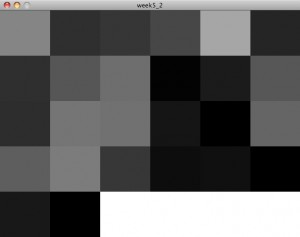

# ICM Week5 XML and Processing

This project was using Simplml and Processing to pull in the netflix top 100 and takes all of the titles and counts the amount of a specific letter there are in the titles. The image below shows the graphic representation of this. There are 26 boxes. The darker the box the lest amount of letters there are. The issue I current have is figuring out how to use PFont with objects.

Here is the code

[Main code](icm/week5/week5_2.pde)

[Letter Object](icm/week5/letter.pde)

*import simpleML.*;  
 letter[] table = new letter[26];  
 char[] rssTemp;  
 int rssLength = 0;  
 String[] headlines;  
 String headlinesTemp;  
 int row = 0;  
 int modInterval = 6;  
 int modNumber = 0;  
 int[] letterAmount = new int[26];  
 PFont f;  
 int letterPosX = 0;  
 int letterPosY = 0;*

*void setup(){  
 size(635,480);  
 smooth();  
 background(255);  
 f = createFont( ” Arial ” ,3,true); // Loading font  
 for(int i = 0; i  
*

* if(i < 6){ row = 0; table[i] = new letter( i , row ,106,96); } if((i >=6) && (i<12)){ row = 96; modNumber = i%modInterval; table[i] = new letter( modNumber , row ,106,96); } if((i >=12) && (i<18)){ row = 192; modNumber = i%modInterval; table[i] = new letter( modNumber , row ,106,96); } if((i >=18) && (i<24)){ row = 288; modNumber = i%modInterval; table[i] = new letter( modNumber , row ,106,96); } if(i>=24){  
 row = 384;  
 modNumber = i%modInterval;  
 table[i] = new letter( modNumber , row ,106,96);  
 }*

* }*

* //end of array parsing  
 XMLRequest xreq = new XMLRequest(this,”http://rss.netflix.com/Top100RSS”);  
 xreq.makeRequest();*

*}*

*void draw(){  
 for(int i = 0; i  
 0){  
 for(int i =0; i< rssLength;i++){ char c = headlinesTemp.charAt(i); if (c >= 97 && c <= 122) {  
 letterAmount[c-97]++;  
 }  
 //println(c);  
 }// end of i for loop*

* }//end of b loop*

* for(int i = 0; i < letterAmount.length; i++){  
 //println((char) (z+97) + ” ” + letterAmount[z]);  
 table[i].setAmount(letterAmount[i]);*

* textFont(f,16);  
 textAlign(LEFT);  
 text(letterAmount[i],letterPosX + 10,letterPosY +10);  
 /*  
 if(i < 6){ letterPosY = 0; letterPosX = i*106; } if((i >=6) && (i<12)){ letterPosY = 96; letterPosX = ((i%modInterval)*106); } if((i >=12) && (i<18)){ letterPosY = 192; letterPosX = ((i%modInterval)*106); } if((i >=18) && (i<24)){ letterPosY = 288; letterPosX = ((i%modInterval)*106); } if(i>=24){  
 letterPosY = 384;  
 letterPosX = ((i%modInterval)*106);*

* }*

* */*

* }*

*}*

*Letter Object*

*class letter{  
 float x;  
 float y;  
 float letterWidth;  
 float letterHeight;*

*int totalAmount = 0;*

*letter(float tempX, float tempY, float widthLetter, float heightLetter){*

*x = tempX;  
 y = tempY;  
 letterWidth = widthLetter;  
 letterHeight = heightLetter;*

*}*

*void display(){*

*fill(totalAmount);  
 noStroke();  
 rect(x*106,y,letterWidth,letterHeight);  
 }*

*/*  
 void letterdisplay(char letterBig){  
 //takes in a letter and displays it at the top right with a margin of 10  
 textFont(f,16);  
 textAlign(LEFT);  
 text(letterBig,x*106 + 10,y +10);*

*}*/  
 void setAmount(int tempAmount){*

*totalAmount = tempAmount;  
 /*  
 takes the total amount and displays it*

**/*

*}*

*}*

**
