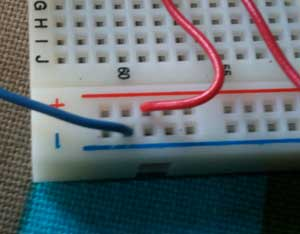

# Lab 1

This is my first PhysComp lab. It involved the alternating the states of two LEDs.

Here is the code I used

More details on the lab could be found [here](http://itp.nyu.edu/physcomp/Labs/DigitalInOut)

*int switchButton = 2; // button  
 int pinYellow = 3; // Yellow LED  
 int pinGreen = 4; // Green LED  
 int switchIni = 0; // Initial state of switch*

*void setup(){  
 pinMode(switchButton, INPUT); //takes in switch signal  
 pinMode(pinYellow, OUTPUT); //yellow output  
 pinMode(pinGreen,OUTPUT); //green output  
 }*

*void loop(){  
 // read the switch  
 switchIni = digitalRead(switchButton);*

*if (switchIni == 1) {  
 // if the switch is closed:  
 digitalWrite(pinYellow, HIGH); // turn on the yellow LED  
 digitalWrite(pinGreen, LOW); // turn off the red LED  
 }  
 else {  
 //if the switch is open:  
 digitalWrite(pinYellow, LOW); // turn off the yellow LED  
 digitalWrite(pinGreen, HIGH); // turn on the red LED  
 }*

*}*  
 In the wiring I initially had an issue with this. I did not realize I had put the red wire in the same rail as the blue. Thus I was getting a short

<object classid="clsid:d27cdb6e-ae6d-11cf-96b8-444553540000" codebase="http://download.macromedia.com/pub/shockwave/cabs/flash/swflash.cab#version=6,0,40,0" height="300" width="400"><param name="allowfullscreen" value="true"></param><param name="allowscriptaccess" value="always"></param><param name="src" value="http://vimeo.com/moogaloop.swf?clip_id=6580726&server=vimeo.com&show_title=1&show_byline=1&show_portrait=0&color=&fullscreen=1"></param><embed allowfullscreen="true" allowscriptaccess="always" height="300" src="http://vimeo.com/moogaloop.swf?clip_id=6580726&server=vimeo.com&show_title=1&show_byline=1&show_portrait=0&color=&fullscreen=1" type="application/x-shockwave-flash" width="400"></embed></object>
[Physcomp – Lab 1](http://vimeo.com/6580726) from [Zeven Rodriguez](http://vimeo.com/user2302394) on [Vimeo](http://vimeo.com).
