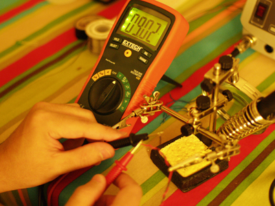
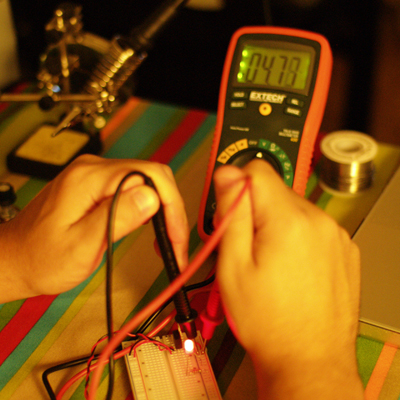

# Lab 3 Working without Arduino

This lab was mostly to focus on building circuits with out the Arduino

I started by first looking at my power adapter. The adapter I was using was Positive on the outside and Negative on the inside.

The power adapter is connected through the breadboard to a 7805 5-volt voltage regulator which drops the 9v to 5v

This is my basic LED circuit with a switch.

<object classid="clsid:d27cdb6e-ae6d-11cf-96b8-444553540000" codebase="http://download.macromedia.com/pub/shockwave/cabs/flash/swflash.cab#version=6,0,40,0" height="300" width="400"><param name="allowfullscreen" value="true"></param><param name="allowscriptaccess" value="always"></param><param name="src" value="http://vimeo.com/moogaloop.swf?clip_id=6815927&server=vimeo.com&show_title=1&show_byline=1&show_portrait=0&color=&fullscreen=1"></param><embed allowfullscreen="true" allowscriptaccess="always" height="300" src="http://vimeo.com/moogaloop.swf?clip_id=6815927&server=vimeo.com&show_title=1&show_byline=1&show_portrait=0&color=&fullscreen=1" type="application/x-shockwave-flash" width="400"></embed></object>

[Physcomp Lab3-Basic circuit](http://vimeo.com/6815927) from [Zeven Rodriguez](http://vimeo.com/user2302394) on [Vimeo](http://vimeo.com).

I then connected another LED in series

<object classid="clsid:d27cdb6e-ae6d-11cf-96b8-444553540000" codebase="http://download.macromedia.com/pub/shockwave/cabs/flash/swflash.cab#version=6,0,40,0" height="300" width="400"><param name="allowfullscreen" value="true"></param><param name="allowscriptaccess" value="always"></param><param name="src" value="http://vimeo.com/moogaloop.swf?clip_id=6815988&server=vimeo.com&show_title=1&show_byline=1&show_portrait=0&color=&fullscreen=1"></param><embed allowfullscreen="true" allowscriptaccess="always" height="300" src="http://vimeo.com/moogaloop.swf?clip_id=6815988&server=vimeo.com&show_title=1&show_byline=1&show_portrait=0&color=&fullscreen=1" type="application/x-shockwave-flash" width="400"></embed></object>

[Physcomp Lab3-Components in Series](http://vimeo.com/6815988) from [Zeven Rodriguez](http://vimeo.com/user2302394) on [Vimeo](http://vimeo.com).

Then measured the first LED in the circuit  

Then the second

Finally, I added with a third LED. When I did that the intensity of the LEDs dropped. The last led dims because most of the voltage is sucked up by the first 2 leaving the last LED with a smaller current.

<object classid="clsid:d27cdb6e-ae6d-11cf-96b8-444553540000" codebase="http://download.macromedia.com/pub/shockwave/cabs/flash/swflash.cab#version=6,0,40,0" height="300" width="400"><param name="allowfullscreen" value="true"></param><param name="allowscriptaccess" value="always"></param><param name="src" value="http://vimeo.com/moogaloop.swf?clip_id=6816161&server=vimeo.com&show_title=1&show_byline=1&show_portrait=0&color=&fullscreen=1"></param><embed allowfullscreen="true" allowscriptaccess="always" height="300" src="http://vimeo.com/moogaloop.swf?clip_id=6816161&server=vimeo.com&show_title=1&show_byline=1&show_portrait=0&color=&fullscreen=1" type="application/x-shockwave-flash" width="400"></embed></object>

[Physcomp Lab3- series Led plus 1](http://vimeo.com/6816161) from [Zeven Rodriguez](http://vimeo.com/user2302394) on [Vimeo](http://vimeo.com).

In the parallel circuit I measured the amperage after the LEDs.

The last part I measured the resistance on a pot.

<object classid="clsid:d27cdb6e-ae6d-11cf-96b8-444553540000" codebase="http://download.macromedia.com/pub/shockwave/cabs/flash/swflash.cab#version=6,0,40,0" height="300" width="400"><param name="allowfullscreen" value="true"></param><param name="allowscriptaccess" value="always"></param><param name="src" value="http://vimeo.com/moogaloop.swf?clip_id=6816307&server=vimeo.com&show_title=1&show_byline=1&show_portrait=0&color=&fullscreen=1"></param><embed allowfullscreen="true" allowscriptaccess="always" height="300" src="http://vimeo.com/moogaloop.swf?clip_id=6816307&server=vimeo.com&show_title=1&show_byline=1&show_portrait=0&color=&fullscreen=1" type="application/x-shockwave-flash" width="400"></embed></object>

[Physcomp Lab3-Pot Variable Voltage Measuring](http://vimeo.com/6816307) from [Zeven Rodriguez](http://vimeo.com/user2302394) on [Vimeo](http://vimeo.com).
