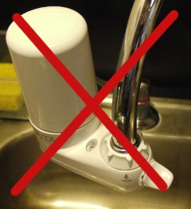

# Observation: The Brita Filter

Observation. Pick a piece of interactive technology in public, used by multiple people. Write down your assumptions as to how it’s used, and describe the context in which it’s being used. Watch people use it, preferably without them knowing they’re being observed. Take notes on how they use it, what they do differently, what appear to be the difficulties, what appear to be the easiest parts. Record what takes the longest, what takes the least amount of time, and how long the whole transaction takes. Consider how the readings from Norman and Crawford reflect on what you see.

Reaction

The piece of technology I chose was a very simple low tech water purifier that had a short life span on the ITP floor. The technology is called the Brita filter. At first, the Brita filter seems to be designed nicely. Its has a very round shape and its white which makes it seem clean and streamline. This I think is the biggest flaw with the Brita filter. It took me a second to figure out how to switch between purified water and tap water. The knob was tough to grab if your hands get wet and the knob seemed to spin continuously. The nail on the coffin for the Brita filter was when I observed some people not realizing that they were washing dishes with the filtered water. I think this happened because people are not invested in the technology. People tend to take for granted that things happen automatically.

I think the biggest problems with the Brita filter could be fixed some what easily. First would be a more visual indicator that you are using purified water (even if they come out of different orifices). The second would be a larger lever as the switch. The Brita filter helps with using countless water bottles. If you do not make it able to become second nature then the technology fails. Sadly, the filter is now gone.
