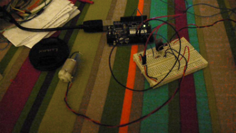

# Physcomp Lab8 - Transistors and HBridge

This week we delt with tranistors and HBridge. The transistor help to control motors, lights, or objects that have a higher voltage that the Arduino cannot power. The Transistor has a Base, Collector, and Emitter. The base goes from a pin of the arduino. This acts like a switch for the object you are controlling. The collector, which is the middle pin, goes to ground. The Emitter, the last pin left to right, takes the ground of a motor in this case. The power to the motor comes from the power source that correlates to the voltage of the motor. In this case, we are taking power from the Vin pin. There is a diode that crosses from the Collector to the Emitter. The silver edge goes to the collector. It helps especially with motors because when they spin down they still are making energy.  

This code is to program the arduino to speed up and slow done the motor.

 const int potPin = 0; // Analog in 0 connected to the potentiometer const int transistorPin = 9; // connected to the base of the transistorint potValue = 0; // value returned from the potentiometervoid**setup**() { // set the transistor pin as output:pinMode(transistorPin, OUTPUT); } void**loop**() { // read the potentiometer, convert it to 0 - 255: potValue = analogRead(potPin) / 4; // use that to control the transistor:analogWrite(9, potValue); }

<object classid="clsid:d27cdb6e-ae6d-11cf-96b8-444553540000" codebase="http://download.macromedia.com/pub/shockwave/cabs/flash/swflash.cab#version=6,0,40,0" height="300" width="400"><param name="allowfullscreen" value="true"></param><param name="allowscriptaccess" value="always"></param><param name="src" value="http://vimeo.com/moogaloop.swf?clip_id=7495071&server=vimeo.com&show_title=1&show_byline=1&show_portrait=0&color=&fullscreen=1"></param><embed allowfullscreen="true" allowscriptaccess="always" height="300" src="http://vimeo.com/moogaloop.swf?clip_id=7495071&server=vimeo.com&show_title=1&show_byline=1&show_portrait=0&color=&fullscreen=1" type="application/x-shockwave-flash" width="400"></embed></object>
[Physcomp Lab8 – Transistor](http://vimeo.com/7495071) from [Zeven Rodriguez](http://vimeo.com/user2302394) on [Vimeo](http://vimeo.com).

Now to the HBridge Lab. The HBridge is used to control multiple actions. In this case we are reversing the direction of a DC motor. This is how the HBridge wiring looks like.

This is my wiring.

Here is the code to get the HBridge to work. This code uses a pot to control the speed and a switch to reverse the direction. If you remove the analogWrite code, it will just work with the switch.

const int switchPin = 2; // switch input  
 const int motor1Pin = 3; // H-bridge leg 1 (pin 2, 1A)  
 const int motor2Pin = 4; // H-bridge leg 2 (pin 7, 2A)  
 const int enablePin = 9; // H-bridge enable pin  
 const int ledPin = 13; // LED  
 int pot= 0;  
 int potValue = 0;  
 void setup() {  
 Serial.begin(9600);  
 // set the switch as an input:  
 pinMode(switchPin, INPUT);

// set all the other pins you’re using as outputs:  
 pinMode(motor1Pin, OUTPUT);  
 pinMode(motor2Pin, OUTPUT);  
 pinMode(enablePin, OUTPUT);  
 pinMode(ledPin, OUTPUT);

// set enablePin high so that motor can turn on:  
 //digitalWrite(enablePin, HIGH);

// blink the LED 3 times. This should happen only once.  
 // if you see the LED blink three times, it means that the module  
 // reset itself,. probably because the motor caused a brownout  
 // or a short.  
 blink(ledPin, 3, 100);  
 }

void loop() {  
 potValue = analogRead(pot);  
 Serial.println(potValue);

// if the switch is high, motor will turn on one direction:  
 if (digitalRead(switchPin) == HIGH) {

analogWrite(enablePin, potValue/4);  
 digitalWrite(motor1Pin, LOW); // set leg 1 of the H-bridge low  
 digitalWrite(motor2Pin, HIGH); // set leg 2 of the H-bridge high  
 }  
 // if the switch is low, motor will turn in the other direction:  
 else {  
 analogWrite(enablePin, potValue/4);  
 digitalWrite(motor1Pin, HIGH); // set leg 1 of the H-bridge high  
 digitalWrite(motor2Pin, LOW); // set leg 2 of the H-bridge low  
 }  
 }

/*  
 blinks an LED  
 */  
 void blink(int whatPin, int howManyTimes, int milliSecs) {  
 int i = 0;  
 for ( i = 0; i < howManyTimes; i++) {  
 digitalWrite(whatPin, HIGH);  
 delay(milliSecs/2);  
 digitalWrite(whatPin, LOW);  
 delay(milliSecs/2);  
 }  
 }

<object classid="clsid:d27cdb6e-ae6d-11cf-96b8-444553540000" codebase="http://download.macromedia.com/pub/shockwave/cabs/flash/swflash.cab#version=6,0,40,0" height="300" width="400"><param name="allowfullscreen" value="true"></param><param name="allowscriptaccess" value="always"></param><param name="src" value="http://vimeo.com/moogaloop.swf?clip_id=7494976&server=vimeo.com&show_title=1&show_byline=1&show_portrait=0&color=&fullscreen=1"></param><embed allowfullscreen="true" allowscriptaccess="always" height="300" src="http://vimeo.com/moogaloop.swf?clip_id=7494976&server=vimeo.com&show_title=1&show_byline=1&show_portrait=0&color=&fullscreen=1" type="application/x-shockwave-flash" width="400"></embed></object>
[Phsycomp Lab8 – HBridge with Pot](http://vimeo.com/7494976) from [Zeven Rodriguez](http://vimeo.com/user2302394) on [Vimeo](http://vimeo.com).
