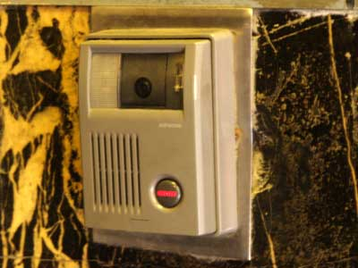
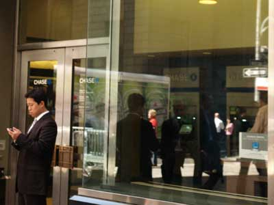
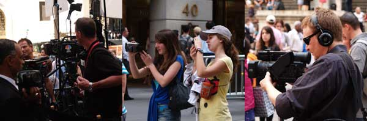
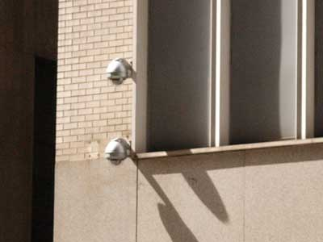
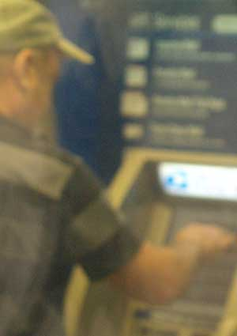
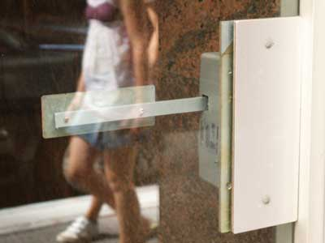
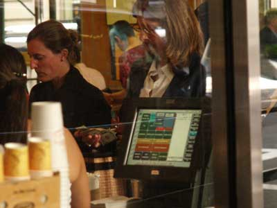
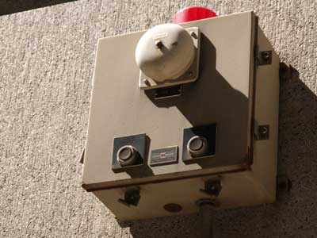

# Sensor Walk

I took a walk around my neighborhood around Wall street. As part of a assignment for my PhysComp class, I documented all the sensors I saw in the area.

Outside of my building this doorbell also contains a camera which picks up anyone who comes close.

Buttons and touch screen on both the cell phone and the ATM help users navigate through menus

Being on Wall St. a lot of tourists and the media are in the area. Most carry cameras which have sensors to detect light and touch screens and buttons to navigate through menus.

Minutes after taking these pictures I tuned in to MSNBC and the scene I documents in the first picture was on TV following the Presidents address at the Federal Reserve.

I counted about 20 security cameras in my area all picking up data on the people on the street

The Postal Office has a teller for automatic mail services with buttons and touch screen

This door signals an emergency when you push the lever

The cashier uses the touch screen on the register to ring up the customer

This alarm has buttons to test the alarm, but function on sensors to sound the alarm

